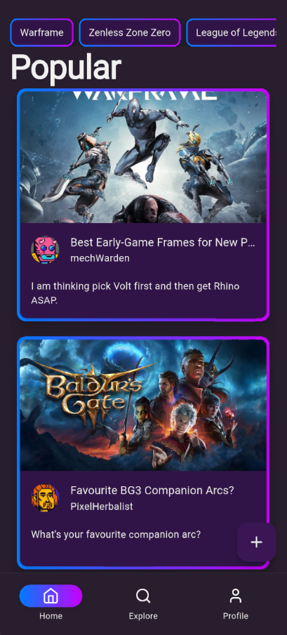
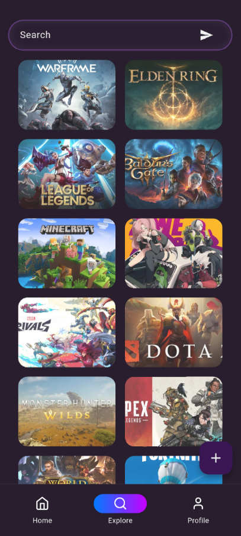
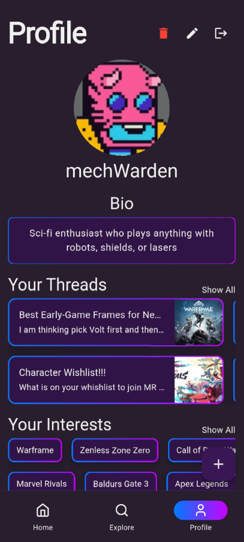

# 🎮 CTRLBuddy

A beautifully designed Flutter application for gamers to connect, discuss, and build friendships based on shared passion for their favorite games.

## 📱 Overview

The Gaming Community App is a modern social platform focused on video games. Users can:

- 🎮 **Add favorite games** to their profile
- 🧵 **Post & comment on threads** related to specific games
- 🤝 **Find like-minded gamers** based on interests
- 🕹️ Enjoy a polished UI with a dark theme and intuitive layout

The app promotes rich interaction between players who love the same games, helping form genuine friendships and game-based communities.

---

## 🚀 Features

- **Game Profile Personalization:** Pick and showcase your top games
- **Discussion Boards:** Post and comment on trending topics
- **Discover Communities:** Follow games and dive into game-specific discussions
- **Stylish Dark Theme:** Designed for comfort and clarity using a custom Flutter theme

---

## Demo

| Home Screen | Explore Screen | Profile Screen |
|-----------------|----------------|-----------------|
|  |  |  |

---

## Tech Stack

| Technology | Purpose |
|------------|---------|
| **Flutter** | Cross-platform mobile development |
| **Firebase Authentication** | User authentication and account management |
| **Cloud Firestore** | Real-time NoSQL database for threads, comments, and user data |
| **Cloudinary** | CDN for game cover images |

---

## Real-time Architecture

The app uses **Firestore streams** to provide live updates across all devices:

1. StreamBuilder pattern
   - Listens to real-time database changes
   - Automatically updates UI when data changes
   - No manual refresh needed

2. Real-time synchronization
   - Comments appear instantly on all connected devices
   - Like counts update in real-time
   - Profile changes propagate immediately
   - Popular threads ranking updates dynamically

---

### Example Flow:

When a user posts a comment:
- Comment is saved to Firestore
- All devices watching that thread receive the update via stream
- UI updates automatically for all users viewing the thread
- No polling or manual refresh required

---

## Usage

#### Authentication
- Sign up and log in with email/password
- Complete profile setup with customizable profile pictures
- Edit profile anytime with instant updates across the app

#### Thread Creation & Discussion
- Browse threads by game categories
- Create new threads under specific games
- Real-time commenting with live synchronization
- Live timestamps (1s, 2m, 3h ago → full date after 24h)

#### Engagement
- Like/unlike threads and comments
- Visual feedback with filled heart icons
- Array-based system prevents duplicate likes
- Popular threads ranked by combined engagement (thread + comment likes)

#### Discovery
- Home screen with popular threads
- Explore and search functionality
- Category filtering by games
- User profiles showing thread history

#### Smart Handling
- Deleted user content shows "Deleted User" fallback
- Profile picture changes update across all user content
- Comments fetch current user profile pictures dynamically

---

## Future Improvements
- Push notifications for replies and likes
- Direct messaging between users
- Moderation tools and content reporting system
- Rich text formatting in comments
- OAuth login (Google, Discord, Steam)
- Thread bookmarking and save functionality
- Comment reply threading